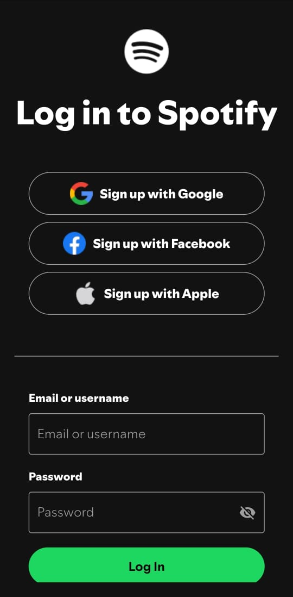
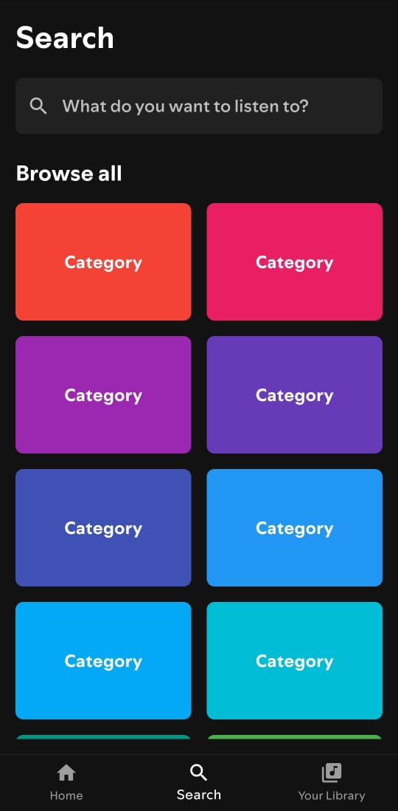

# Spotify Clone in Flutter

### Mobile Application Development Course - 5th Semester BSCS
### Term Project

1. Used Spotify official icons, font family, and color palette.
2. Setup android splash screen.
3. Features implemented:
   - Spotify User Authentication using Spotify Web API
   - Fetch Spotify User's Profile, Recently Played, Made For You, Playlists
   - Track playback

### Screenshots

  
  
  
  
  
  
  

